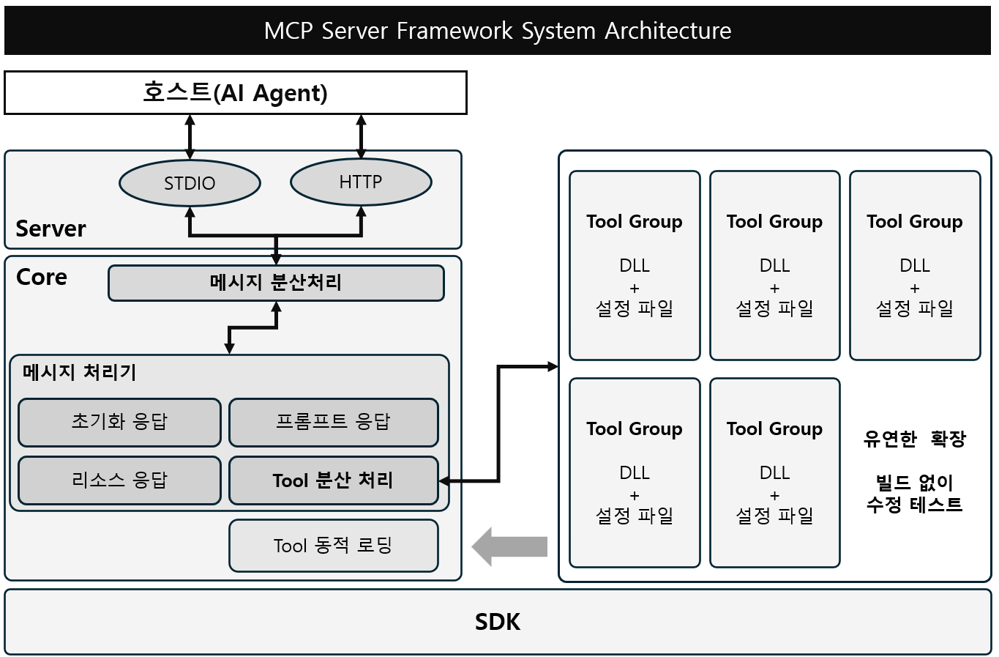

# MCP Server Framework

> **Enterprise-ready MCP (Model Context Protocol) Server Framework**  
> 제조 현장 폐쇄망 환경에 최적화된 확장 가능한 AI 에이전트 도구 MCP 서버

## 🎯 핵심 특징

- **🔌 플러그인 아키텍처**: DLL 기반 동적 도구 로딩으로 **재빌드 없는 확장**
- **📋 Manifest 기반**: JSON으로 도구 메타데이터 관리 (**LLM 최적화**)
- **🔒 폐쇄망 친화적**: 화이트리스트 기반 보안 및 오프라인 운영
- **⚡ Zero-Code 튜닝**: Description 변경을 위한 코드 수정 불필요

## 📚 문서

- **[아키텍처 가이드](docs/architecture.md)** - 전체 시스템 구조
- **[개발자 가이드](docs/developer-guide.md)** - 도구 개발 상세 가이드  
- **[배포 가이드](docs/deployment.md)** - 제조 현장 배포 방법
- **[API 참조](docs/api-reference.md)** - MCP 프로토콜 API
- **[예제 모음](docs/examples.md)** - 다양한 사용 사례

## ⚙️ 시스템 구조

## 📄 라이선스

MIT License - [LICENSE](LICENSE) 파일 참조

## 👨‍💻 작성자

**문형옥 (Mun Hyeongog)** 

## 🔗 링크 

- [`코딩스타일 가이드`](https://google.github.io/styleguide/csharp-style.html)

---
