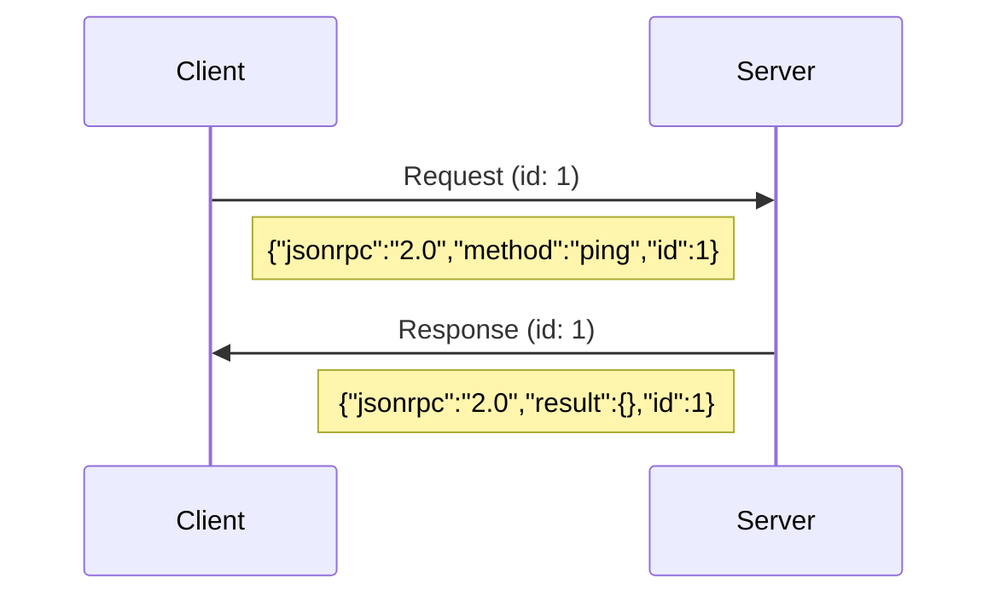
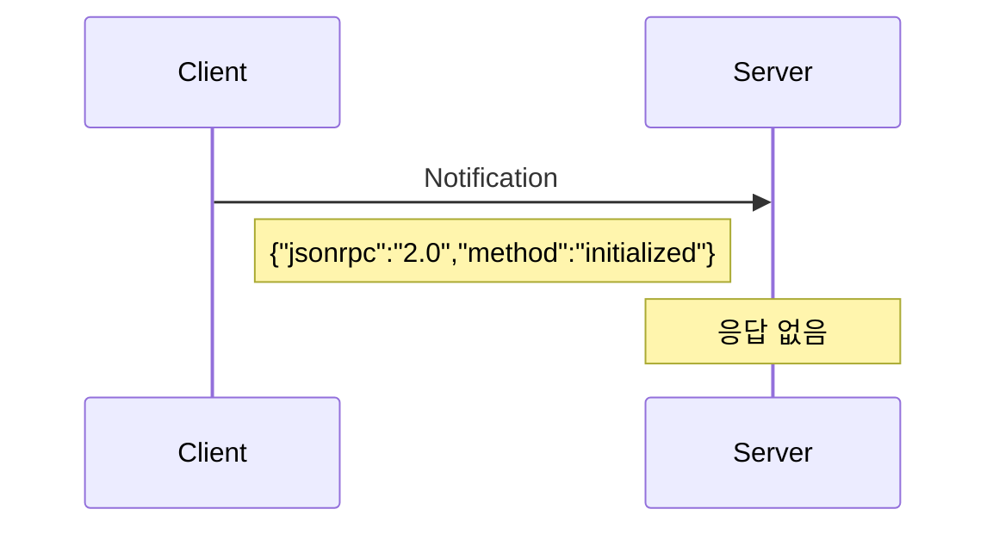
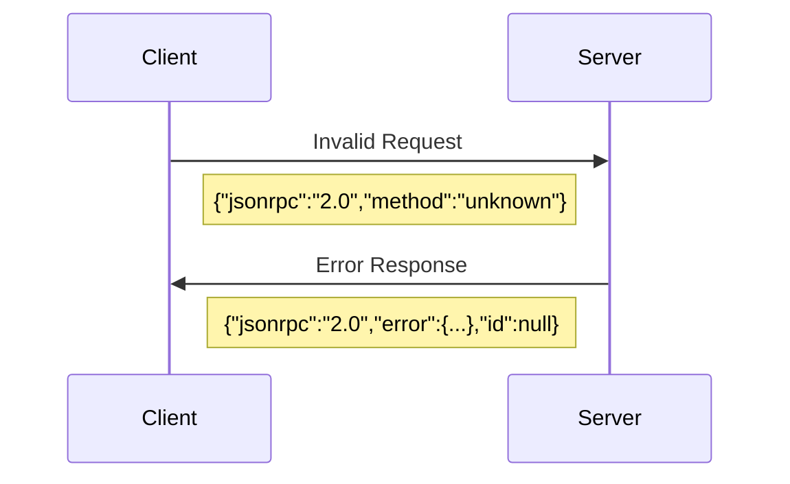

# 🔌 JSON-RPC 기본 이해

> **MCP의 통신 기반인 JSON-RPC 2.0 프로토콜을 상세히 알아봅니다**

MCP는 **JSON-RPC 2.0** 프로토콜을 기반으로 클라이언트와 서버 간 통신을 수행합니다. JSON-RPC의 구조와 동작 방식을 이해하면 MCP 메시지 흐름을 더 명확하게 파악할 수 있습니다.

## 📋 JSON-RPC 2.0 개요

### **정의**
JSON-RPC는 **경량화된 원격 프로시저 호출(RPC) 프로토콜**로, JSON을 사용하여 데이터를 교환합니다.

### **핵심 특징**
- ✅ **단순함**: 최소한의 오버헤드
- ✅ **상태 비저장**: 각 요청은 독립적
- ✅ **양방향**: 클라이언트↔서버 모두 요청 가능
- ✅ **전송 독립**: HTTP, WebSocket, STDIO 등 다양한 전송 방식 지원

## 📨 메시지 구조

### **1. 요청 (Request)**

```json
{
  "jsonrpc": "2.0",
  "method": "method_name",
  "params": { ... },
  "id": 1
}
```

#### **필드 설명**
- **`jsonrpc`**: 반드시 `"2.0"` (프로토콜 버전)
- **`method`**: 호출할 메서드명 (문자열)
- **`params`**: 매개변수 (객체 또는 배열, 선택사항)
- **`id`**: 요청 식별자 (문자열, 숫자, null)

#### **실제 예시**
```json
{
  "jsonrpc": "2.0",
  "method": "tools/call",
  "params": {
    "name": "Echo_Echo",
    "arguments": {
      "text": "Hello, MCP!"
    }
  },
  "id": 42
}
```

### **2. 성공 응답 (Success Response)**

```json
{
  "jsonrpc": "2.0", 
  "result": { ... },
  "id": 1
}
```

#### **필드 설명**
- **`jsonrpc`**: 반드시 `"2.0"`
- **`result`**: 메서드 실행 결과 (모든 JSON 타입 가능)
- **`id`**: 해당 요청의 ID와 동일

#### **실제 예시**
```json
{
  "jsonrpc": "2.0",
  "result": {
    "content": [
      {
        "type": "text",
        "text": "Hello, MCP!"
      }
    ],
    "isError": false
  },
  "id": 42
}
```

### **3. 에러 응답 (Error Response)**

```json
{
  "jsonrpc": "2.0",
  "error": {
    "code": -32601,
    "message": "Method not found",
    "data": "additional info"
  },
  "id": 1
}
```

#### **에러 객체 구조**
- **`code`**: 에러 코드 (정수)
- **`message`**: 에러 메시지 (문자열)
- **`data`**: 추가 에러 정보 (선택사항)

#### **표준 에러 코드**
| 코드 | 의미 | 설명 |
|------|------|------|
| -32700 | Parse error | JSON 파싱 실패 |
| -32600 | Invalid Request | 잘못된 요청 형식 |
| -32601 | Method not found | 메서드를 찾을 수 없음 |
| -32602 | Invalid params | 잘못된 매개변수 |
| -32603 | Internal error | 서버 내부 오류 |

### **4. 알림 (Notification)**

```json
{
  "jsonrpc": "2.0",
  "method": "notifications/initialized",
  "params": { ... }
}
```

#### **특징**
- **`id` 필드 없음**: 응답을 기대하지 않음
- **단방향**: 클라이언트 → 서버 또는 서버 → 클라이언트
- **응답 없음**: 성공/실패 여부를 알 수 없음

## 🔄 통신 흐름

### **요청-응답 패턴**


### **알림 패턴**


### **에러 처리 패턴**


## 🎯 MCP에서의 JSON-RPC 활용

### **MCP 표준 메서드들**

#### **핵심 메서드**
```json
// 1. 서버 초기화
{
  "jsonrpc": "2.0",
  "method": "initialize",
  "params": {
    "protocolVersion": "2025-06-18",
    "clientInfo": { "name": "TestClient", "version": "1.0" },
    "capabilities": {}
  },
  "id": 1
}

// 2. 도구 목록 조회
{
  "jsonrpc": "2.0", 
  "method": "tools/list",
  "id": 2
}

// 3. 도구 실행
{
  "jsonrpc": "2.0",
  "method": "tools/call", 
  "params": {
    "name": "Echo_Echo",
    "arguments": { "text": "test" }
  },
  "id": 3
}
```

#### **리소스 관련**
```json
// 리소스 목록
{
  "jsonrpc": "2.0",
  "method": "resources/list",
  "id": 4
}

// 리소스 읽기  
{
  "jsonrpc": "2.0",
  "method": "resources/read",
  "params": {
    "uri": "file://config.json"
  },
  "id": 5
}
```

#### **프롬프트 관련**
```json
// 프롬프트 목록
{
  "jsonrpc": "2.0",
  "method": "prompts/list", 
  "id": 6
}

// 프롬프트 실행
{
  "jsonrpc": "2.0",
  "method": "prompts/get",
  "params": {
    "name": "code-review",
    "arguments": {
      "code": "public void Test() {}",
      "language": "csharp"
    }
  },
  "id": 7
}
```

## 🚀 전송 방식

### **1. STDIO (표준 입출력)**
```bash
# 클라이언트 → 서버 (stdin)
{"jsonrpc":"2.0","method":"tools/list","id":1}

# 서버 → 클라이언트 (stdout)  
{"jsonrpc":"2.0","result":{"tools":[...]},"id":1}
```

### **2. HTTP POST**
```http
POST /mcp HTTP/1.1
Content-Type: application/json

{"jsonrpc":"2.0","method":"tools/list","id":1}
```

```http
HTTP/1.1 200 OK
Content-Type: application/json

{"jsonrpc":"2.0","result":{"tools":[...]},"id":1}
```

### **3. WebSocket (향후 지원)**
```javascript
// WebSocket을 통한 실시간 통신
ws.send('{"jsonrpc":"2.0","method":"tools/list","id":1}');
```

## ⚠️ 주의사항 및 모범 사례

### **ID 관리**
```json
// ✅ 좋은 예: 순차적 또는 UUID 사용
{"jsonrpc":"2.0","method":"ping","id":1}
{"jsonrpc":"2.0","method":"ping","id":"550e8400-e29b-41d4-a716-446655440000"}

// ❌ 나쁜 예: ID 중복 또는 예측 가능한 패턴
{"jsonrpc":"2.0","method":"ping","id":1}
{"jsonrpc":"2.0","method":"ping","id":1}  // 중복!
```

### **에러 처리**
```json
// ✅ 구체적인 에러 정보 제공
{
  "jsonrpc": "2.0",
  "error": {
    "code": -32602,
    "message": "Invalid params",
    "data": "Parameter 'text' is required but missing"
  },
  "id": 1
}

// ❌ 모호한 에러 정보
{
  "jsonrpc": "2.0", 
  "error": {
    "code": -32603,
    "message": "Error"
  },
  "id": 1
}
```

### **매개변수 구조**
```json
// ✅ 명확한 객체 구조
{
  "jsonrpc": "2.0",
  "method": "tools/call",
  "params": {
    "name": "FileReader",
    "arguments": {
      "path": "/path/to/file.txt",
      "encoding": "utf-8"
    }
  },
  "id": 1
}

// ❌ 모호한 배열 구조  
{
  "jsonrpc": "2.0",
  "method": "tools/call", 
  "params": ["FileReader", "/path/to/file.txt", "utf-8"],
  "id": 1
}
```

## 🔍 디버깅 팁

### **메시지 추적**
```javascript
// 요청 로깅
console.log('[SEND]', JSON.stringify(request, null, 2));

// 응답 로깅  
console.log('[RECV]', JSON.stringify(response, null, 2));
```

### **JSON 검증**
```bash
# JSON 형식 검증
echo '{"jsonrpc":"2.0","method":"test"}' | jq .

# 스키마 검증 (jsonschema 사용)
jsonschema -i message.json schema.json
```

---

**다음**: [MCP Server Framework 개요](server-overview.md) - 본 프레임워크의 특징과 장점 →

**이전**: [← MCP 핵심 개념](mcp-concepts.md)