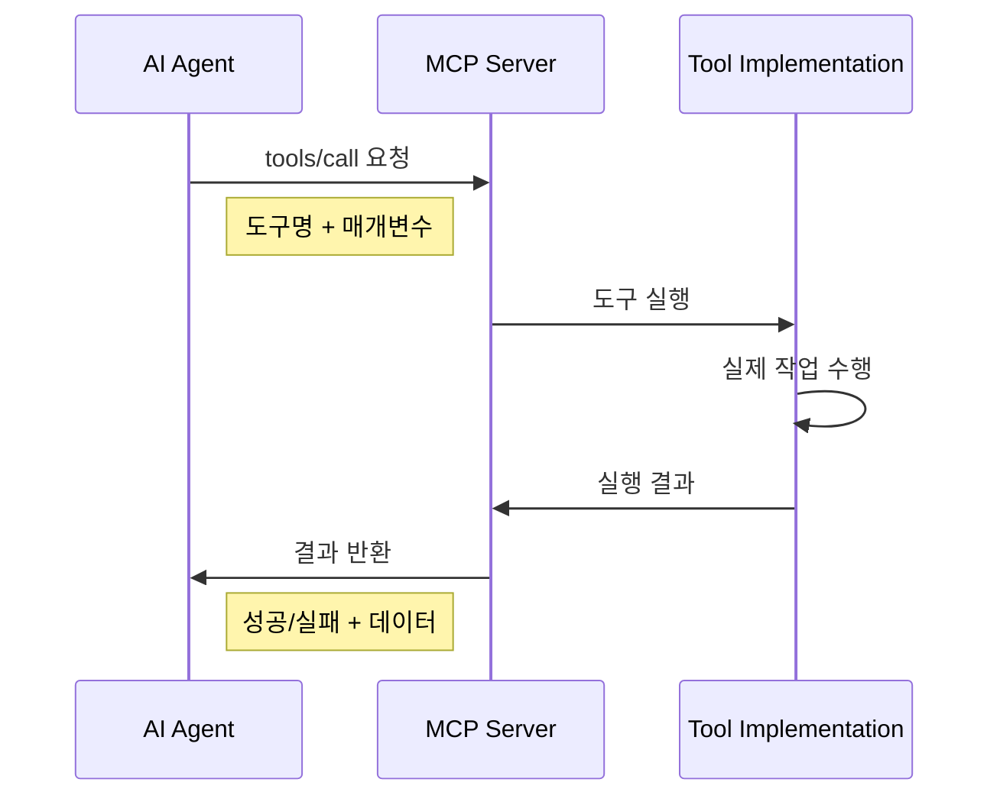
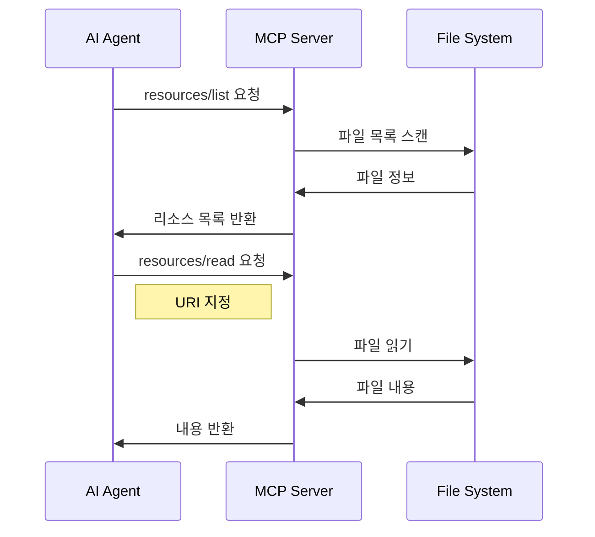
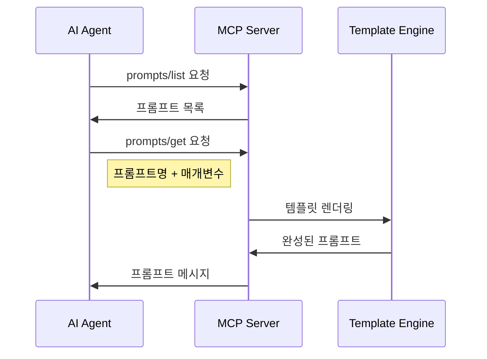
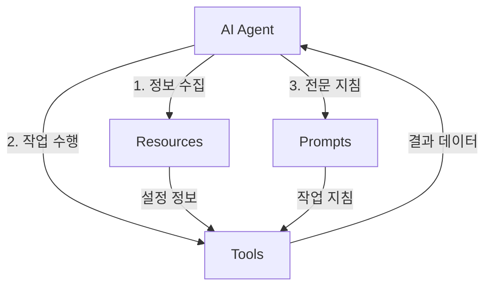

# 🧩 MCP 핵심 개념

> **Tools, Resources, Prompts - MCP의 3가지 핵심 구성 요소를 깊이 이해합니다**

MCP는 AI와 외부 시스템 간의 상호작용을 **3가지 핵심 개념**으로 표준화합니다. 각각의 역할과 특징을 명확히 이해하는 것이 효과적인 MCP 활용의 열쇠입니다.

## 🎯 3가지 핵심 구성 요소

```
┌─────────────────────────────────────────────────────────────┐
│                        MCP Server                           │
├─────────────────┬─────────────────┬─────────────────────────┤
│     🔧 Tools    │  📄 Resources   │      💬 Prompts         │
│                 │                 │                         │
│   AI가 실행할    │  AI가 읽을      │   AI가 사용할           │
│   기능들         │  정보/파일들     │   템플릿들              │
└─────────────────┴─────────────────┴─────────────────────────┘
```

## 🔧 Tools (도구)

### **정의**
AI가 **능동적으로 실행**할 수 있는 기능들입니다. 함수 호출과 유사하며, 입력 매개변수를 받아 작업을 수행하고 결과를 반환합니다.

### **특징**
- ✅ **실행 가능**: AI가 직접 호출하여 작업 수행
- ✅ **매개변수**: 입력값을 통한 동적 동작
- ✅ **결과 반환**: 작업 결과를 구조화된 형태로 제공
- ✅ **상태 변경**: 외부 시스템의 상태를 변경할 수 있음

### **실제 예시**

#### **파일 조작 도구**
```json
{
  "name": "FileTools_ReadFile",
  "description": "파일 내용을 읽어옵니다",
  "inputSchema": {
    "type": "object",
    "properties": {
      "path": {
        "type": "string",
        "description": "읽을 파일의 경로"
      },
      "encoding": {
        "type": "string", 
        "description": "파일 인코딩 (기본값: utf-8)"
      }
    },
    "required": ["path"]
  }
}
```

#### **데이터베이스 쿼리 도구**
```json
{
  "name": "Database_ExecuteQuery",
  "description": "SQL 쿼리를 실행합니다",
  "inputSchema": {
    "type": "object",
    "properties": {
      "query": {
        "type": "string",
        "description": "실행할 SQL 쿼리"
      },
      "parameters": {
        "type": "array",
        "description": "쿼리 매개변수"
      }
    },
    "required": ["query"]
  }
}
```

### **Tool 실행 흐름**


## 📄 Resources (리소스)

### **정의**
AI가 **읽기 전용으로 접근**할 수 있는 정보나 파일들입니다. 참조 자료, 설정 파일, 문서 등이 해당됩니다.

### **특징**
- ✅ **읽기 전용**: 조회만 가능, 수정 불가
- ✅ **URI 기반**: 고유한 URI로 식별
- ✅ **메타데이터**: 파일 크기, 타입, 설명 등 제공
- ✅ **다양한 형식**: 텍스트, JSON, XML, Markdown 등

### **실제 예시**

#### **리소스 목록**
```json
{
  "resources": [
    {
      "uri": "file://config/database.json",
      "name": "Database Configuration",
      "description": "데이터베이스 연결 설정",
      "mimeType": "application/json",
      "size": 1024
    },
    {
      "uri": "file://docs/api-guide.md", 
      "name": "API 사용 가이드",
      "description": "REST API 사용법 문서",
      "mimeType": "text/markdown",
      "size": 5120
    }
  ]
}
```

#### **리소스 내용 읽기**
```json
{
  "contents": [
    {
      "uri": "file://config/database.json",
      "mimeType": "application/json",
      "text": "{\n  \"connectionString\": \"...\",\n  \"timeout\": 30\n}"
    }
  ]
}
```

### **Resource 접근 흐름**


## 💬 Prompts (프롬프트)

### **정의**  
AI가 활용할 수 있는 **재사용 가능한 프롬프트 템플릿**들입니다. 전문 지식이나 특정 작업을 위한 구조화된 지시사항을 제공합니다.

### **특징**
- ✅ **템플릿화**: 매개변수를 통한 동적 내용 생성
- ✅ **재사용성**: 여러 상황에서 반복 사용 가능
- ✅ **전문성**: 특정 도메인의 전문 지식 포함
- ✅ **구조화**: 일관된 형식과 품질 보장

### **실제 예시**

#### **프롬프트 정의**
```json
{
  "name": "code-review",
  "description": "코드 리뷰를 위한 전문 프롬프트",
  "arguments": [
    {
      "name": "code",
      "description": "리뷰할 코드",
      "type": "string",
      "required": true
    },
    {
      "name": "language", 
      "description": "프로그래밍 언어",
      "type": "string",
      "required": false
    }
  ]
}
```

#### **프롬프트 템플릿 (Markdown)**
```markdown
# 코드 리뷰 요청

다음 {language} 코드를 전문적으로 리뷰해주세요:

```{language}
{code}
```

## 리뷰 관점

다음 관점에서 검토해주세요:
- 코드 가독성과 구조
- 잠재적 버그나 문제점  
- 성능 개선 가능성
- 베스트 프랙티스 준수 여부
- 보안 고려사항

구체적이고 실행 가능한 개선 제안을 제공해주세요.
```

### **Prompt 사용 흐름**


## 🔄 구성 요소 간 상호작용

### **통합 사용 시나리오**


### **실제 워크플로우 예시**

#### **시나리오: 자동 코드 분석**
1. **Resource**: `project-guidelines.md` 읽기 → 프로젝트 코딩 규칙 확인
2. **Tool**: `Git_GetChangedFiles` 실행 → 변경된 파일 목록 획득
3. **Tool**: `File_ReadFile` 실행 → 각 파일 내용 읽기
4. **Prompt**: `code-review` 사용 → 전문적인 코드 리뷰 수행
5. **Tool**: `Report_Generate` 실행 → 리뷰 결과 보고서 생성

## 📊 구성 요소 비교

| 구분 | Tools | Resources | Prompts |
|------|-------|-----------|---------|
| **목적** | 작업 수행 | 정보 제공 | 지침 제공 |
| **접근 방식** | 실행 (Execute) | 읽기 (Read) | 사용 (Use) |
| **상태 변경** | ✅ 가능 | ❌ 불가능 | ❌ 불가능 |
| **매개변수** | ✅ 동적 입력 | ❌ 고정 URI | ✅ 템플릿 변수 |
| **결과** | 구조화된 데이터 | 파일/텍스트 내용 | 렌더링된 메시지 |
| **사용 시점** | 작업 필요 시 | 정보 필요 시 | 지침 필요 시 |

## 🎯 설계 원칙

### **Tools 설계 원칙**
- **단일 책임**: 하나의 도구는 하나의 명확한 기능
- **멱등성**: 같은 입력에 대해 일관된 결과  
- **에러 처리**: 명확한 성공/실패 구분
- **문서화**: 상세한 매개변수 및 결과 설명

### **Resources 설계 원칙**  
- **논리적 구조**: 계층적이고 직관적인 URI 구조
- **메타데이터**: 충분한 설명과 타입 정보
- **접근 제어**: 필요한 리소스만 노출
- **효율성**: 적절한 캐싱과 크기 관리

### **Prompts 설계 원칙**
- **재사용성**: 다양한 상황에서 활용 가능
- **명확성**: 구체적이고 이해하기 쉬운 지시사항
- **유연성**: 매개변수를 통한 커스터마이징
- **전문성**: 도메인 특화된 고품질 내용

---

**다음**: [JSON-RPC 기본 이해](json-rpc-basics.md) - MCP 통신 프로토콜 상세 →

**이전**: [← MCP란 무엇인가?](what-is-mcp.md)