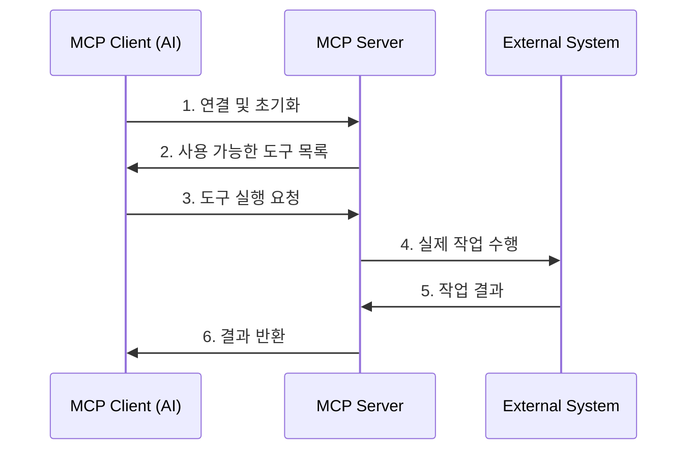

# 🤖 MCP란 무엇인가?

> **Model Context Protocol (MCP) - AI 에이전트와 외부 시스템을 연결하는 표준 프로토콜**

## 📋 MCP 정의

**Model Context Protocol (MCP)**는 AI 모델(LLM)이 외부 시스템과 안전하고 표준화된 방식으로 상호작용할 수 있도록 하는 **오픈 소스 프로토콜**입니다.

MCP를 통해 AI는 다음과 같은 작업을 수행할 수 있습니다:
- 🔧 **도구 실행**: 파일 읽기, API 호출, 데이터베이스 쿼리 등
- 📄 **정보 접근**: 문서, 설정 파일, 실시간 데이터 등
- 💬 **프롬프트 활용**: 미리 정의된 전문 프롬프트 템플릿

## 🎯 MCP가 해결하는 문제

### **문제 1: AI의 제한된 접근성**
```
❌ 기존 방식
AI 모델 → [격리된 환경] → 외부 시스템 접근 불가

✅ MCP 방식  
AI 모델 → [MCP Server] → 외부 시스템 안전 접근
```

### **문제 2: 비표준화된 통합**
- **기존**: 각 AI 도구마다 다른 연결 방식
- **MCP**: 표준화된 JSON-RPC 기반 프로토콜

### **문제 3: 보안 및 권한 관리**
- **기존**: 직접 접근으로 인한 보안 위험
- **MCP**: 서버를 통한 통제된 접근

## 🏗️ MCP 아키텍처 개요

```
┌─────────────────┐    ┌─────────────────┐    ┌─────────────────┐
│   MCP Client    │    │   MCP Server    │    │ External System │
│                 │    │                 │    │                 │
│ - Claude        │◄──►│ - Tools         │◄──►│ - Files         │
│ - Custom AI     │    │ - Resources     │    │ - APIs          │
│ - Applications  │    │ - Prompts       │    │ - Databases     │
└─────────────────┘    └─────────────────┘    └─────────────────┘
        │                        │                        │
        │                        │                        │
    JSON-RPC 2.0           비즈니스 로직            실제 작업 수행
```

### **구성 요소**
- **MCP Client**: AI 모델 또는 AI 애플리케이션
- **MCP Server**: 중간 계층 - 요청 처리 및 권한 관리
- **External System**: 실제 작업을 수행하는 시스템

## 🌟 MCP의 핵심 특징

### **1. 표준화**
- JSON-RPC 2.0 기반 통신
- 일관된 메시지 형식
- 다양한 언어/플랫폼 지원

### **2. 보안성**
- 서버를 통한 통제된 접근
- 권한 기반 작업 제한
- 감사 로깅 지원

### **3. 확장성**
- 플러그인 아키텍처
- 새로운 도구 쉽게 추가
- 모듈식 설계

### **4. 상호 운용성**
- 다양한 AI 모델과 호환
- 크로스 플랫폼 지원
- 표준 프로토콜 준수

## 🔄 MCP 동작 흐름



### **단계별 설명**
1. **초기화**: 클라이언트가 서버에 연결하고 capabilities 협상
2. **도구 발견**: 사용 가능한 도구, 리소스, 프롬프트 목록 조회
3. **작업 요청**: AI가 필요한 작업 요청
4. **실행**: 서버가 실제 시스템에서 작업 수행
5. **결과 반환**: 작업 결과를 AI에게 전달

## 🎪 실제 사용 사례

### **제조업 디지털 트윈**
```
AI Assistant → MCP Server → PLC 시스템
                        → 센서 데이터
                        → 설비 상태 DB
```

### **개발 도구 통합**
```
AI Coding Assistant → MCP Server → Git Repository
                                → Code Database  
                                → CI/CD Pipeline
```

### **문서 관리 시스템**
```
AI Documentation → MCP Server → File System
                             → Knowledge Base
                             → Template Engine
```

## 🆚 MCP vs 기존 방식

| 구분 | 기존 방식 | MCP 방식 |
|------|-----------|----------|
| **통합 복잡도** | 각각 다른 API | 표준 JSON-RPC |
| **보안** | 직접 접근 | 서버 중개 |
| **확장성** | 개별 구현 | 플러그인 방식 |
| **유지보수** | 분산 관리 | 중앙 집중 |
| **재사용성** | 낮음 | 높음 |

## 🎯 왜 MCP인가?

### **개발자 관점**
- ✅ **표준화된 개발**: 일관된 API 패턴
- ✅ **빠른 통합**: 기존 라이브러리 재사용
- ✅ **쉬운 확장**: 새 기능 추가 용이

### **운영자 관점**  
- ✅ **중앙 집중 관리**: 하나의 서버로 모든 연결 관리
- ✅ **보안 강화**: 통제된 접근과 권한 관리
- ✅ **모니터링**: 모든 활동 추적 가능

### **사용자 관점**
- ✅ **일관된 경험**: 어떤 AI 도구든 동일한 방식
- ✅ **풍부한 기능**: 다양한 외부 시스템 활용
- ✅ **안정성**: 표준화된 에러 처리

---

**다음**: [MCP 핵심 개념](mcp-concepts.md) - Tools, Resources, Prompts의 상세한 이해 →

**이전**: [← Fundamental 홈](README.md)