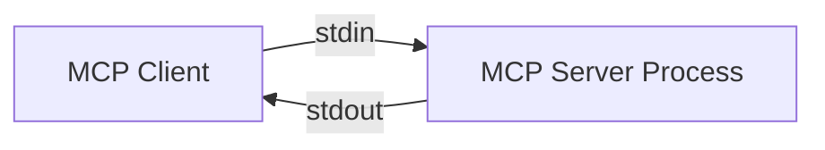
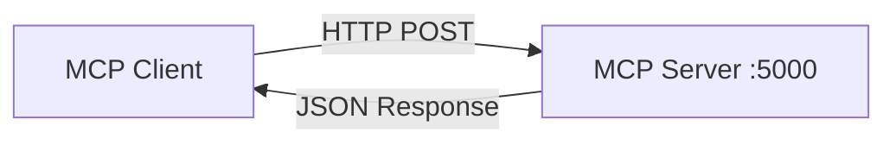

# 🔌 클라이언트 연결

> **다양한 MCP 클라이언트를 MCP Server Framework와 연결하는 방법을 마스터합니다**

MCP Server가 준비되었다면 이제 실제 AI 클라이언트들을 연결해보겠습니다. 이 문서에서는 MCP 클라이언트 연결의 기본 개념부터 실제 설정 방법까지 상세히 다룹니다.

## 🎯 MCP 클라이언트란?

MCP 클라이언트는 **MCP Server에 연결하여 도구, 리소스, 프롬프트를 활용하는 애플리케이션**입니다.

### **주요 MCP 클라이언트들**
- **Claude Desktop** - Anthropic의 공식 데스크톱 앱
- **VS Code 확장** - 개발 환경 통합
- **Web Applications** - 브라우저 기반 애플리케이션
- **Custom Applications** - 직접 개발한 애플리케이션

## 🔄 연결 방식 이해

MCP Server Framework는 **2가지 주요 전송 방식**을 지원합니다:

### **1. STDIO (표준 입출력)**


**특징:**
- ✅ **직접 통신**: 프로세스 간 직접 파이프 연결
- ✅ **낮은 지연시간**: 네트워크 오버헤드 없음
- ✅ **높은 보안**: 로컬 프로세스 통신
- ❌ **단일 클라이언트**: 한 번에 하나의 클라이언트만 연결

**적합한 사용 사례:**
- Claude Desktop 연결
- VS Code 확장
- 로컬 개발 도구

### **2. HTTP (웹 API)**


**특징:**
- ✅ **다중 클라이언트**: 여러 클라이언트 동시 연결
- ✅ **네트워크 접근**: 원격 서버 연결 가능
- ✅ **표준 프로토콜**: HTTP/HTTPS 사용
- ❌ **추가 지연시간**: 네트워크 오버헤드

**적합한 사용 사례:**
- 웹 애플리케이션
- 마이크로서비스 아키텍처
- 클라우드 배포

## 🛠️ 클라이언트 설정 방법

### **Claude Desktop 연결 (STDIO)**

#### **1. MCP Server 설정 확인**
```json
{
  "Features": {
    "EnableStdio": true
  }
}
```

#### **2. Claude Desktop 설정**
Claude Desktop의 설정 파일 위치:
- **Windows**: `%APPDATA%\Claude\claude_desktop_config.json`
- **macOS**: `~/Library/Application Support/Claude/claude_desktop_config.json`
- **Linux**: `~/.config/Claude/claude_desktop_config.json`

```json
{
  "mcpServers": {
    "mcp-server-framework": {
      "command": "dotnet",
      "args": [
        "run",
        "--project",
        "C:\\path\\to\\Micube.MCP.Server"
      ],
      "env": {
        "ASPNETCORE_ENVIRONMENT": "Production"
      }
    }
  }
}
```

#### **3. 빌드된 실행 파일 사용**
```json
{
  "mcpServers": {
    "mcp-server-framework": {
      "command": "C:\\path\\to\\publish\\Micube.MCP.Server.exe",
      "args": [],
      "env": {
        "ASPNETCORE_ENVIRONMENT": "Production"
      }
    }
  }
}
```

### **VS Code 확장 연결 (STDIO)**

#### **1. MCP 확장 설치**
```bash
# VS Code에서 MCP 확장 검색 및 설치
ext install mcp-client
```

#### **2. settings.json 설정**
```json
{
  "mcp.servers": [
    {
      "name": "MCP Server Framework",
      "command": "dotnet",
      "args": [
        "run",
        "--project",
        "${workspaceFolder}/src/Micube.MCP.Server"
      ],
      "cwd": "${workspaceFolder}",
      "env": {
        "ASPNETCORE_ENVIRONMENT": "Development"
      }
    }
  ]
}
```

## 🔐 연결 보안 설정

### **STDIO 보안**
```json
{
  "Features": {
    "EnableStdio": true,
    "EnableHttp": false  // HTTP 비활성화로 보안 강화
  },
  "ToolGroups": {
    "Whitelist": ["ApprovedTools.dll"]  // 승인된 도구만
  }
}
```

### **HTTP 보안**
```json
{
  "Kestrel": {
    "Endpoints": {
      "Https": {
        "Url": "https://localhost:5001",
        "Certificate": {
          "Path": "certificate.pfx",
          "Password": "${CERT_PASSWORD}"
        }
      }
    }
  },
  "Features": {
    "EnableStdio": false,  // STDIO 비활성화
    "EnableHttp": true
  }
}
```

#### **CORS 설정 (웹 클라이언트용)**
```json
{
  "Cors": {
    "AllowedOrigins": [
      "https://your-web-app.com",
      "http://localhost:3000"
    ],
    "AllowedMethods": ["POST", "GET"],
    "AllowedHeaders": ["Content-Type", "Authorization"]
  }
}
```

## 🌐 네트워크 설정

### **방화벽 설정**
```bash
# Linux - HTTP 포트 열기
sudo ufw allow 5555/tcp

# Windows - 포트 열기
netsh advfirewall firewall add rule name="MCP Server" dir=in action=allow protocol=TCP localport=5555
```

### **프록시 환경**
```json
{
  "Kestrel": {
    "Endpoints": {
      "Http": {
        "Url": "http://0.0.0.0:5555"
      }
    }
  },
  "ForwardedHeaders": {
    "ForwardedProto": "X-Forwarded-Proto",
    "ForwardedFor": "X-Forwarded-For"
  }
}
```

## 🧪 연결 테스트

### **1. 기본 연결 테스트**
```bash
# STDIO 테스트
echo '{"jsonrpc":"2.0","id":1,"method":"initialize","params":{"protocolVersion":"2025-06-18","clientInfo":{"name":"TestClient","version":"1.0"},"capabilities":{}}}' | dotnet run

# HTTP 테스트  
curl -X POST http://localhost:5555/mcp \
  -H "Content-Type: application/json" \
  -d '{"jsonrpc":"2.0","id":1,"method":"initialize","params":{"protocolVersion":"2025-06-18","clientInfo":{"name":"TestClient","version":"1.0"},"capabilities":{}}}'
```

### **2. 도구 호출 테스트**
```bash
# HTTP로 Echo 도구 테스트
curl -X POST http://localhost:5555/mcp \
  -H "Content-Type: application/json" \
  -d '{
    "jsonrpc": "2.0",
    "id": 2,
    "method": "tools/call",
    "params": {
      "name": "Echo_Echo",
      "arguments": {"text": "Connection test successful!"}
    }
  }'
```

### **3. 헬스체크**
```bash
# 서버 상태 확인
curl http://localhost:5555/health

# 상세 상태 확인
curl http://localhost:5555/health/detailed
```

## 🔧 연결 문제 해결

### **일반적인 문제들**

#### **1. STDIO 연결 실패**
```bash
# 증상: "Process exited with code 1"
# 해결: 서버 로그 확인
# 로그 파일 위치 (appappsettings.json 확인)

# 가능한 원인들:
# - 설정 파일 오류
# - 도구 DLL 누락
# - 권한 문제
```

#### **2. HTTP 연결 실패**
```bash
# 증상: "Connection refused"
# 해결: 포트 및 방화벽 확인
netstat -tlnp | grep 5555
telnet localhost 5555
```

#### **3. 인증서 오류**
```bash
# 증상: "SSL handshake failed"
# 해결: 인증서 확인
openssl x509 -in certificate.crt -text -noout
```

## 🚀 성능 최적화

### **STDIO 최적화**
```json
{
  "Logging": {
    "MinLevel": "Info"  // Debug 로그 비활성화
  }
}
```

### **HTTP 최적화**
```json
{
  "Kestrel": {
    "Limits": {
      "MaxConcurrentConnections": 100,
      "KeepAliveTimeout": "00:05:00",
      "RequestHeadersTimeout": "00:00:30"
    }
  }
}
```

## 🎯 클라이언트별 특성

### **Claude Desktop**
- **장점**: 공식 지원, 안정적 STDIO 연결
- **단점**: Windows/macOS만 지원
- **권장 설정**: STDIO 전용, 최소 로깅

### **VS Code**
- **장점**: 개발 환경 통합, 디버깅 지원
- **단점**: 확장 의존성
- **권장 설정**: 개발 모드, 상세 로깅

### **웹 애플리케이션**
- **장점**: 플랫폼 독립적, 다중 사용자
- **단점**: 네트워크 지연, 보안 고려 필요
- **권장 설정**: HTTPS, CORS 설정

### **Custom Application**
- **장점**: 완전한 제어, 특화 기능
- **단점**: 직접 구현 필요
- **권장 설정**: 요구사항에 따라 STDIO/HTTP 선택

---

**다음**: [연결 예제](connection-examples/) - 실제 환경별 연결 설정 예제 →

**이전**: [← 서버 설정](server-config.md)