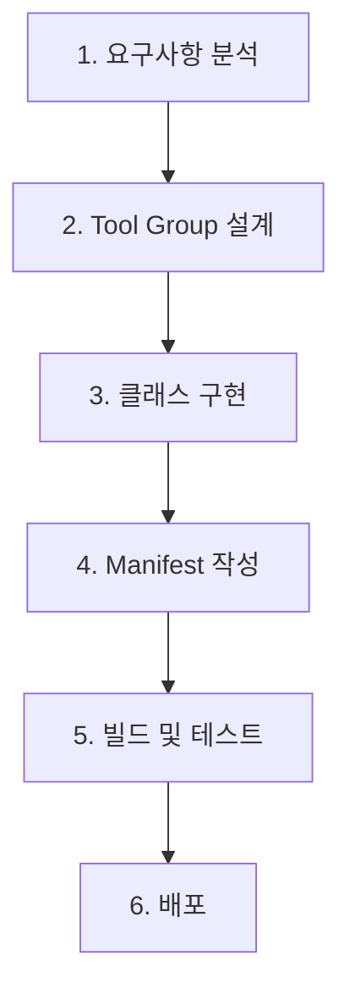

# 🛠️ 도구 개발

> **커스텀 Tool Group을 설계하고 구현하는 완전한 가이드**

MCP Server Framework의 핵심은 **플러그인 기반 Tool Group 시스템**입니다. 이 문서에서는 실무에서 바로 활용할 수 있는 도구를 개발하는 방법을 단계별로 설명합니다.

## 🎯 Tool Group 개발 프로세스



## 📋 1단계: 요구사항 분석

### **설계 질문들**
- 어떤 기능을 제공할 것인가?
- 입력 매개변수는 무엇인가?
- 출력 형식은 어떻게 할 것인가?
- 에러 상황은 어떻게 처리할 것인가?

### **예시: 파일 처리 도구**
```
요구사항:
- 파일 읽기/쓰기 기능
- 여러 파일 형식 지원 (txt, json, csv)
- 에러 상황 처리 (파일 없음, 권한 없음)
- 파일 크기 제한
```

## 🏗️ 2단계: Tool Group 설계

### **프로젝트 생성**

* ⚠️⚠️⚠️ **아래 표시한 사항은 Tool DLL 개발에 필수입니다. 꼭 지켜야 합니다.** ⚠️⚠️⚠️

```xml
<Project Sdk="Microsoft.NET.Sdk"> // Clase Library 프로젝트로 생성합니다.  dotnet new classlib -n SampleTools(툴이름)

  <PropertyGroup>
    <TargetFramework>net8.0</TargetFramework> // net8.0 이상 
    <ImplicitUsings>enable</ImplicitUsings>
    <Nullable>enable</Nullable>
  </PropertyGroup>

  <ItemGroup>
    <ProjectReference Include="..\..\Micube.MCP.SDK\Micube.MCP.SDK.csproj" />  //이 프로젝트를 참조해야 합니다. 추후 Nuget 배포 검토 예정입니다.
  </ItemGroup>

  <ItemGroup>
    <PackageReference Include="Oracle.ManagedDataAccess.Core" Version="23.9.1" /> // 필요한 라이브러리를 추가합니다. 관련 모든 DLL은 tools 폴더에 같이 저장. 
  </ItemGroup>

  <PropertyGroup>
    <CopyLocalLockFileAssemblies>true</CopyLocalLockFileAssemblies> // 이 옵션을 반드시 설정해야 합니다. 그래야만 연관된 모든 DLL이 출력 폴더에 복사 됩니다.
  </PropertyGroup>

</Project>

```


### **기본 구조**
```csharp
using Micube.MCP.SDK.Abstracts;
using Micube.MCP.SDK.Attributes;
using Micube.MCP.SDK.Interfaces;
using Micube.MCP.SDK.Models;

[McpToolGroup("FileTools", "file-tools.json", "File operation tools")]
public class FileToolGroup : BaseToolGroup
{
    public override string GroupName { get; } = "FileTools";
    
    public FileToolGroup(IMcpLogger logger) : base(logger) { }

    protected override void OnConfigure(JsonElement? config)
    {
        // 설정 초기화
    }

    [McpTool("ReadFile")]
    public async Task<object> ReadFileAsync(Dictionary<string, object> parameters)
    {
        // 구현
    }
}
```

### **핵심 구성요소**

#### **McpToolGroupAttribute**
```csharp
[McpToolGroup(
    groupName: "FileTools",           // 그룹 식별자
    manifestPath: "file-tools.json", // Manifest 파일명
    description: "File operations"   // 설명 (선택사항)
)]
```

#### **BaseToolGroup 상속**
- `GroupName`: 그룹 고유 이름
- `OnConfigure()`: 설정 초기화 메서드
- `Logger`: 로깅 인터페이스

#### **McpToolAttribute**
```csharp
[McpTool("ReadFile")]  // 도구 식별자
public async Task<object> ReadFileAsync(Dictionary<string, object> parameters)
```

## 🔨 3단계: 실제 구현

### **완전한 파일 도구 예제**

```csharp
using System.Text.Json;
using Micube.MCP.SDK.Abstracts;
using Micube.MCP.SDK.Attributes;
using Micube.MCP.SDK.Interfaces;
using Micube.MCP.SDK.Models;

[McpToolGroup("FileTools", "file-tools.json", "Advanced file operation tools")]
public class FileToolGroup : BaseToolGroup
{
    public override string GroupName { get; } = "FileTools";
    
    private string? _basePath;
    private long _maxFileSize = 10 * 1024 * 1024; // 10MB 기본값

    public FileToolGroup(IMcpLogger logger) : base(logger) { }

    protected override void OnConfigure(JsonElement? config)
    {
        if (config.HasValue)
        {
            if (config.Value.TryGetProperty("basePath", out var basePathElement))
            {
                _basePath = basePathElement.GetString();
                Logger.LogInfo($"FileTools configured with basePath: {_basePath}");
            }

            if (config.Value.TryGetProperty("maxFileSize", out var maxSizeElement))
            {
                _maxFileSize = maxSizeElement.GetInt64();
                Logger.LogInfo($"FileTools configured with maxFileSize: {_maxFileSize} bytes");
            }
        }
    }

    [McpTool("ReadFile")]
    public async Task<object> ReadFileAsync(Dictionary<string, object> parameters)
    {
        try
        {
            // 1. 매개변수 검증
            if (!parameters.TryGetValue("path", out var pathObj) || pathObj?.ToString() is not string path)
            {
                return ToolCallResult.Fail("Parameter 'path' is required and must be a string");
            }

            // 2. 경로 처리
            var fullPath = GetSafePath(path);
            if (fullPath == null)
            {
                return ToolCallResult.Fail($"Invalid or unsafe path: {path}");
            }

            // 3. 파일 존재 여부 확인
            if (!File.Exists(fullPath))
            {
                return ToolCallResult.Fail($"File not found: {path}");
            }

            // 4. 파일 크기 확인
            var fileInfo = new FileInfo(fullPath);
            if (fileInfo.Length > _maxFileSize)
            {
                return ToolCallResult.Fail($"File too large: {fileInfo.Length} bytes (max: {_maxFileSize})");
            }

            // 5. 파일 읽기
            var content = await File.ReadAllTextAsync(fullPath);
            
            Logger.LogInfo($"Successfully read file: {path} ({fileInfo.Length} bytes)");

            return content;
        }
        catch (UnauthorizedAccessException)
        {
            return ToolCallResult.Fail($"Access denied: {parameters["path"]}");
        }
        catch (Exception ex)
        {
            Logger.LogError($"Error reading file: {ex.Message}", ex);
            return ToolCallResult.Fail($"Failed to read file: {ex.Message}");
        }
    }

    [McpTool("WriteFile")]
    public async Task<ToolCallResult> WriteFileAsync(Dictionary<string, object> parameters)
    {
        try
        {
            // 1. 매개변수 검증
            if (!parameters.TryGetValue("path", out var pathObj) || pathObj?.ToString() is not string path)
            {
                return ToolCallResult.Fail("Parameter 'path' is required");
            }

            if (!parameters.TryGetValue("content", out var contentObj) || contentObj?.ToString() is not string content)
            {
                return ToolCallResult.Fail("Parameter 'content' is required");
            }

            // 2. 경로 처리
            var fullPath = GetSafePath(path);
            if (fullPath == null)
            {
                return ToolCallResult.Fail($"Invalid or unsafe path: {path}");
            }

            // 3. 내용 크기 확인
            var contentBytes = System.Text.Encoding.UTF8.GetBytes(content);
            if (contentBytes.Length > _maxFileSize)
            {
                return ToolCallResult.Fail($"Content too large: {contentBytes.Length} bytes");
            }

            // 4. 디렉토리 생성
            var directory = Path.GetDirectoryName(fullPath);
            if (!string.IsNullOrEmpty(directory) && !Directory.Exists(directory))
            {
                Directory.CreateDirectory(directory);
            }

            // 5. 파일 쓰기
            await File.WriteAllTextAsync(fullPath, content);
            
            Logger.LogInfo($"Successfully wrote file: {path} ({contentBytes.Length} bytes)");

            return ToolCallResult.Success($"File written successfully: {contentBytes.Length} bytes");
        }
        catch (Exception ex)
        {
            Logger.LogError($"Error writing file: {ex.Message}", ex);
            return ToolCallResult.Fail($"Failed to write file: {ex.Message}");
        }
    }

    [McpTool("ListFiles")]
    public async Task<object> ListFilesAsync(Dictionary<string, object> parameters)
    {
        try
        {
            // 1. 매개변수 처리 (선택사항)
            var path = parameters.TryGetValue("path", out var pathObj) ? pathObj?.ToString() : ".";
            var pattern = parameters.TryGetValue("pattern", out var patternObj) ? patternObj?.ToString() : "*";

            // 2. 경로 처리
            var fullPath = GetSafePath(path ?? ".");
            if (fullPath == null || !Directory.Exists(fullPath))
            {
                return ToolCallResult.Fail($"Directory not found: {path}");
            }

            // 3. 파일 목록 조회
            var files = Directory.GetFiles(fullPath, pattern)
                .Take(100) // 결과 제한
                .Select(f => new
                {
                    name = Path.GetFileName(f),
                    path = Path.GetRelativePath(_basePath ?? Environment.CurrentDirectory, f),
                    size = new FileInfo(f).Length,
                    modified = File.GetLastWriteTime(f).ToString("yyyy-MM-dd HH:mm:ss")
                })
                .ToList();

            Logger.LogInfo($"Listed {files.Count} files in {path}");

            return new { files, count = files.Count };
        }
        catch (Exception ex)
        {
            Logger.LogError($"Error listing files: {ex.Message}", ex);
            return ToolCallResult.Fail($"Failed to list files: {ex.Message}");
        }
    }

    /// <summary>
    /// 안전한 경로 처리 (경로 탐색 공격 방지)
    /// </summary>
    private string? GetSafePath(string path)
    {
        try
        {
            var basePath = _basePath ?? Environment.CurrentDirectory;
            var fullPath = Path.GetFullPath(Path.Combine(basePath, path));

            // basePath 밖으로 나가는 것을 방지
            if (!fullPath.StartsWith(Path.GetFullPath(basePath)))
            {
                Logger.LogError($"Path traversal attempt blocked: {path}");
                return null;
            }

            return fullPath;
        }
        catch
        {
            return null;
        }
    }
}
```

## 📄 4단계: Manifest 파일 작성

### **file-tools.json**
```json
{
  "GroupName": "FileTools",
  "Version": "1.2.0",
  "Description": "Advanced file operation tools with safety features",
  "Author": "Development Team",
  "Tools": [
    {
      "Name": "ReadFile",
      "Description": "Reads content from a text file with safety checks",
      "Parameters": [
        {
          "Name": "path",
          "Type": "string",
          "Required": true,
          "Description": "File path relative to base directory"
        }
      ]
    },
    {
      "Name": "WriteFile", 
      "Description": "Writes content to a file with safety checks",
      "Parameters": [
        {
          "Name": "path",
          "Type": "string",
          "Required": true,
          "Description": "File path relative to base directory"
        },
        {
          "Name": "content",
          "Type": "string",
          "Required": true,
          "Description": "Content to write to the file"
        }
      ]
    },
    {
      "Name": "ListFiles",
      "Description": "Lists files in a directory",
      "Parameters": [
        {
          "Name": "path",
          "Type": "string", 
          "Required": false,
          "Description": "Directory path (default: current directory)"
        },
        {
          "Name": "pattern",
          "Type": "string",
          "Required": false,
          "Description": "File pattern filter (default: *)"
        }
      ]
    }
  ],
  "Config": {
    "basePath": "./data",
    "maxFileSize": 10485760
  }
}
```

## 🔍 5단계: 고급 기능 구현

### **구조화된 출력**
```csharp
[McpTool("AnalyzeFile")]
public async Task<object> AnalyzeFileAsync(Dictionary<string, object> parameters)
{
    // 파일 분석 로직...
    
    var analysis = new
    {
        fileInfo = new { size, encoding, lineCount },
        content = new { wordCount, charCount },
        metadata = new { created, modified, type }
    };

    // JSON Schema 정의
    var schema = new
    {
        type = "object",
        properties = new
        {
            fileInfo = new { type = "object" },
            content = new { type = "object" },
            metadata = new { type = "object" }
        }
    };

    return schema;
}
```

### **비동기 처리**
```csharp
[McpTool("ProcessLargeFile")]
public async Task<ToolCallResult> ProcessLargeFileAsync(Dictionary<string, object> parameters)
{
    using var cts = new CancellationTokenSource(TimeSpan.FromMinutes(5));
    
    try
    {
        await ProcessFileWithProgressAsync(filePath, cts.Token);
        return ToolCallResult.Success("Processing completed");
    }
    catch (OperationCanceledException)
    {
        return ToolCallResult.Fail("Processing timed out after 5 minutes");
    }
}
```

### **설정 기반 동작**
```csharp
protected override void OnConfigure(JsonElement? config)
{
    if (config.HasValue)
    {
        // 설정에서 허용된 확장자 로드
        if (config.Value.TryGetProperty("allowedExtensions", out var extElement))
        {
            _allowedExtensions = extElement.EnumerateArray()
                .Select(x => x.GetString())
                .Where(x => x != null)
                .ToHashSet();
        }
    }
}
```

## ⚠️ 모범 사례

### **1. 에러 처리**
```csharp
try
{
    // 도구 로직
}
catch (ArgumentException ex)
{
    return ToolCallResult.Fail($"Invalid argument: {ex.Message}");
}
catch (FileNotFoundException)
{
    return ToolCallResult.Fail("File not found");
}
catch (UnauthorizedAccessException)
{
    return ToolCallResult.Fail("Access denied");
}
catch (Exception ex)
{
    Logger.LogError($"Unexpected error: {ex.Message}", ex);
    return ToolCallResult.Fail("An unexpected error occurred");
}
```

### **2. 매개변수 검증**
```csharp
private static bool ValidateParameters(Dictionary<string, object> parameters, out string error)
{
    error = string.Empty;

    if (!parameters.TryGetValue("path", out var pathObj) || string.IsNullOrEmpty(pathObj?.ToString()))
    {
        error = "Parameter 'path' is required";
        return false;
    }

    // 추가 검증 로직...
    return true;
}
```

### **3. 리소스 관리**
```csharp
[McpTool("ProcessStream")]
public async Task<ToolCallResult> ProcessStreamAsync(Dictionary<string, object> parameters)
{
    using var fileStream = File.OpenRead(filePath);
    using var reader = new StreamReader(fileStream);
    
    // 스트림 처리...
    
    return ToolCallResult.Success("Processing completed");
}
```

## 🧪 테스트 및 디버깅

### **단위 테스트 예제**
```csharp
[Test]
public async Task ReadFile_ValidPath_ReturnsContent()
{
    // Arrange
    var logger = new MockLogger();
    var fileTools = new FileToolGroup(logger);
    var parameters = new Dictionary<string, object> { ["path"] = "test.txt" };

    // Act
    var result = await fileTools.ReadFileAsync(parameters);

    // Assert
    Assert.IsFalse(result.IsError);
    Assert.IsNotEmpty(result.Content[0].Text);
}
```

### **로깅 활용**
```csharp
Logger.LogDebug($"Processing file: {path}");
Logger.LogInfo($"File processed successfully: {result.Length} bytes");
Logger.LogError($"Processing failed: {ex.Message}", ex);
```

* **주의** 반드시 ToolGroup DLL 파일은 연관된 모든 DLL 파일과 함께 tools폴더에 저장해야 합니다.

---

**다음**: [리소스 관리](resource-management.md) - Resource 시스템 활용 →

**이전**: [← Development 홈](README.md)