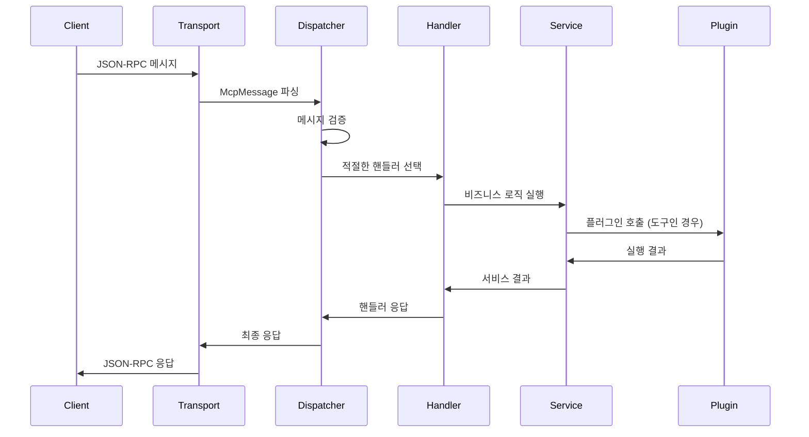

# 🏗️ Architecture - 시스템 구조

> **MCP Server Framework의 내부 아키텍처와 설계 원칙을 이해합니다**

## 🎯 아키텍처 개요

MCP Server Framework는 **확장 가능한 플러그인 아키텍처**를 기반으로 설계되었습니다.

```
┌─────────────────────────────────────────────────────────────┐
│                    Transport Layer                          │
│  ┌─────────────────┐  ┌─────────────────┐                  │
│  │   STDIO Handler │  │  HTTP Controller │                  │
│  └─────────────────┘  └─────────────────┘                  │
├─────────────────────────────────────────────────────────────┤
│                  Message Dispatcher                        │
│               (JSON-RPC 메시지 라우팅)                       │
├─────────────────────────────────────────────────────────────┤
│                    Method Handlers                         │
│  ┌──────────────┐ ┌──────────────┐ ┌──────────────┐        │
│  │   Initialize │ │     Tools    │ │   Resources  │        │
│  │      Ping    │ │              │ │   Prompts    │        │
│  └──────────────┘ └──────────────┘ └──────────────┘        │
├─────────────────────────────────────────────────────────────┤
│                      Services                              │
│  ┌──────────────┐ ┌──────────────┐ ┌──────────────┐        │
│  │Tool Dispatcher│ │Resource Svc  │ │ Prompt Svc   │        │
│  │Session State │ │Capabilities  │ │               │        │
│  └──────────────┘ └──────────────┘ └──────────────┘        │
├─────────────────────────────────────────────────────────────┤
│                   Plugin Layer                             │
│  ┌─────────────────┐  ┌─────────────────┐                  │
│  │  SampleTools    │  │  CustomTools    │                  │
│  │     .dll        │  │     .dll        │                  │
│  └─────────────────┘  └─────────────────┘                  │
└─────────────────────────────────────────────────────────────┘
```

## 🔧 핵심 컴포넌트

### **1. Transport Layer (전송 계층)**
클라이언트와의 통신을 담당합니다.

```csharp
// STDIO 전송
public class StdioRunner
{
    private readonly IMcpMessageDispatcher _dispatcher;
    
    public async Task RunAsync(CancellationToken cancellationToken)
    {
        // stdin에서 JSON-RPC 메시지 읽기
        // dispatcher로 처리 위임
        // stdout으로 응답 전송
    }
}

// HTTP 전송
[ApiController]
public class McpController : ControllerBase
{
    [HttpPost]
    public async Task<IActionResult> Post([FromBody] McpMessage message)
    {
        var result = await _dispatcher.HandleAsync(message);
        return Ok(result);
    }
}
```

### **2. Message Dispatcher (메시지 디스패처)**
JSON-RPC 메시지를 적절한 핸들러로 라우팅합니다.

```csharp
public class McpMessageDispatcher : IMcpMessageDispatcher
{
    private readonly Dictionary<string, IMethodHandler> _handlers;
    
    public async Task<object?> HandleAsync(McpMessage message)
    {
        // 1. 메시지 검증
        // 2. 핸들러 찾기
        // 3. 초기화 상태 확인
        // 4. 핸들러 실행
        return await handler.HandleAsync(message);
    }
}
```

### **3. Method Handlers (메서드 핸들러)**
각 MCP 메서드의 구체적인 로직을 구현합니다.

| 핸들러 | 메서드 | 기능 |
|--------|--------|------|
| `InitializeHandler` | `initialize` | 클라이언트 초기화 |
| `ToolsListHandler` | `tools/list` | 도구 목록 조회 |
| `ToolsCallHandler` | `tools/call` | 도구 실행 |
| `ResourcesListHandler` | `resources/list` | 리소스 목록 |
| `PromptsGetHandler` | `prompts/get` | 프롬프트 실행 |

### **4. Plugin Architecture (플러그인 아키텍처)**
동적 도구 로딩을 위한 핵심 설계입니다.

```csharp
// 도구 그룹 로더
public class ToolGroupLoader
{
    public List<LoadedToolGroup> LoadFromDirectory(string directory, string[]? whitelistDlls)
    {
        // 1. DLL 파일 스캔
        // 2. McpToolGroupAttribute 찾기
        // 3. 인스턴스 생성 (IMcpLogger 주입)
        // 4. Manifest 파일 파싱
        // 5. 메타데이터 설정
    }
}

// 도구 디스패처
public class ToolDispatcher : IToolDispatcher
{
    public async Task<ToolCallResult> InvokeAsync(string fullToolName, Dictionary<string, object> parameters)
    {
        // GroupName_ToolName 형식 파싱
        // 해당 그룹 찾기
        // 도구 실행
    }
}
```

## 🔄 메시지 처리 흐름

### **요청 처리 시퀀스**


## 🏛️ 설계 원칙

### **1. 의존성 주입 (Dependency Injection)**
모든 컴포넌트는 인터페이스를 통해 의존성을 주입받습니다.

```csharp
// Program.cs
services.AddSingleton<IMcpLogger, LogDispatcher>();
services.AddSingleton<IToolDispatcher, ToolDispatcher>();
services.AddSingleton<IMcpMessageDispatcher, McpMessageDispatcher>();
services.AddTransient<IMethodHandler, ToolsCallHandler>();
```

### **2. 플러그인 격리**
각 도구 그룹은 독립적으로 로드되고 실행됩니다.

```csharp
[McpToolGroup("FileTools", "file-tools.json")]
public class FileToolGroup : BaseToolGroup
{
    // 독립적인 생명주기
    // 별도 DLL로 배포
    // 런타임 로드/언로드 가능
}
```

### **3. 비동기 처리**
모든 I/O 작업은 비동기로 처리됩니다.

```csharp
public async Task<ToolCallResult> InvokeAsync(string toolName, Dictionary<string, object> parameters)
{
    // 모든 도구 호출은 비동기
    // 취소 토큰 지원
    // 백프레셰어 없이 확장 가능
}
```

### **4. 확장성**
새로운 기능은 플러그인으로 쉽게 추가할 수 있습니다.

```
새 도구 추가 과정:
1. DLL 개발 (SDK 사용)
2. Manifest 작성 (JSON)
3. tools/ 폴더에 복사
4. 서버 재시작 
```

## 🔐 보안 아키텍처

### **화이트리스트 기반 로딩**
```json
{
  "ToolGroups": {
    "Whitelist": ["ApprovedTool.dll", "SecurityTool.dll"]
  }
}
```

### **권한 격리**
- 각 도구 그룹은 별도 프로세스 공간에서 실행 (향후)
- 파일 시스템 접근 제한
- 네트워크 접근 제어

### **입력 검증**
```csharp
// 모든 입력은 스키마 기반 검증
var validation = ValidateArguments(definition, arguments);
if (!validation.IsValid) {
    return ToolCallResult.Fail("Invalid parameters");
}
```

---

**다음**: [API Reference](../07-api/README.md) - API 문서 →

**이전**: [← Deployment](../05-deployment/README.md)