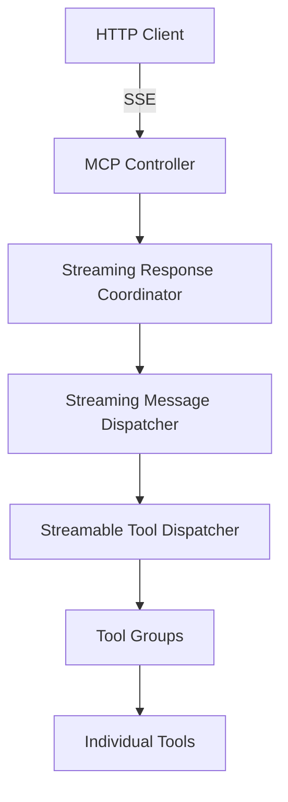

# MCP Streamable Server Framework

## 📋 Overview

MCP Streamable Server는 Model Context Protocol (MCP)에 **스트리밍 기능을 추가**한 확장 프레임워크입니다. 실시간 데이터 스트리밍을 통해 대규모 응답이나 점진적 결과를 효율적으로 전달할 수 있습니다.

### 주요 특징

- 🚀 **SSE (Server-Sent Events) 기반 스트리밍**: HTTP를 통한 실시간 데이터 전송
- 📦 **청크 기반 데이터 전송**: 대용량 응답을 작은 단위로 분할하여 전송
- 🔌 **플러그인 아키텍처**: 커스텀 스트리밍 도구 그룹 쉽게 추가 가능
- 🎯 **Clean Architecture**: SRP 원칙에 따른 명확한 책임 분리
- 💡 **비동기 스트리밍**: `IAsyncEnumerable` 기반의 효율적인 스트리밍

## 🏗️ Architecture

### 프로젝트 구조

```
Streamable/
├── Micube.MCP.SDK.Streamable/        # 스트리밍 SDK (도구 개발용)
├── Micube.MCP.Core.Streamable/       # 스트리밍 코어 로직
├── Micube.MCP.Server.Streamable/     # ASP.NET Core 서버 구현
└── StreamableTools/                  # 샘플 도구들
```

### 계층 구조



## 🔧 Core Components

### 1. **Micube.MCP.SDK.Streamable**

스트리밍 도구를 개발하기 위한 SDK 라이브러리입니다.

#### 주요 인터페이스
- `IStreamableMcpToolGroup`: 스트리밍 도구 그룹의 기본 인터페이스
- `BaseStreamableToolGroup`: 도구 그룹 구현을 위한 추상 클래스

#### 핵심 모델
- `StreamChunk`: 스트리밍 데이터 청크
  - Type: Content, Error, Complete, Progress
  - Content: 실제 데이터
  - IsFinal: 마지막 청크 여부
  - Progress: 진행률 (0.0 ~ 1.0)
  - Metadata: 추가 메타데이터

### 2. **Micube.MCP.Core.Streamable**

스트리밍 기능의 핵심 비즈니스 로직을 담당합니다.

#### 주요 컴포넌트

**Dispatchers/**
- `StreamingMessageDispatcher`: 메시지 라우팅 및 디스패칭
- `StreamableToolDispatcher`: 도구 실행 조정

**Handlers/**
- `ToolsCallStreamHandler`: tools/call 엔드포인트의 스트리밍 처리

**Services/** (SRP에 따라 도메인별 분리)
- `Dispatcher/`: 메시지 검증, 핸들러 레지스트리, 세션 검증
- `Handler/`: 에러 청크 생성, MCP 응답 래핑
- `Streaming/`: 스트림 실행 조정
- `Tool/`: 도구 이름 파싱, 그룹 관리, 실행 조정

### 3. **Micube.MCP.Server.Streamable**

ASP.NET Core 기반의 HTTP 서버 구현입니다.

#### API Endpoints

| Endpoint | Method | Description | Streaming |
|----------|--------|-------------|-----------|
| `/mcp` | POST | SSE 스트리밍 엔드포인트 | ✅ |
| `/health` | GET | 서버 상태 확인 | ❌ |
| `/health/details` | GET | 상세 상태 정보 | ❌ |

#### 주요 서비스
- `HttpStreamingResponseService`: HTTP 스트리밍 응답 설정
- `SseFormatter`: SSE 포맷 변환
- `HeartbeatService`: 연결 유지를 위한 하트비트
- `StreamingResponseCoordinator`: 스트리밍 응답 조정

## 🚀 Getting Started

### 1. 서버 실행

```bash
cd src/Streamable/Micube.MCP.Server.Streamable
dotnet run
```

서버는 기본적으로 `http://localhost:5556`에서 실행됩니다.

### 2. 커스텀 도구 그룹 만들기

```csharp
using Micube.MCP.SDK.Streamable.Abstracts;

public class MyStreamableTools : BaseStreamableToolGroup
{
    public override string GroupName => "MyTools";

    [StreamableToolMethod]
    public async IAsyncEnumerable<StreamChunk> GenerateReport(
        [ToolParam("topic", "보고서 주제")] string topic)
    {
        yield return new StreamChunk 
        { 
            Type = StreamChunkType.Progress,
            Progress = 0.0,
            Content = "보고서 생성 시작..."
        };

        // 실제 처리 로직
        for (int i = 1; i <= 10; i++)
        {
            await Task.Delay(500); // 시뮬레이션
            yield return new StreamChunk 
            { 
                Type = StreamChunkType.Content,
                Content = $"섹션 {i} 생성 중...",
                Progress = i / 10.0
            };
        }

        yield return new StreamChunk 
        { 
            Type = StreamChunkType.Complete,
            Content = "보고서 생성 완료!",
            IsFinal = true
        };
    }
}
```

### 3. 도구 등록

`appsettings.json`에서 도구 DLL을 화이트리스트에 추가:

```json
{
  "ToolGroups": {
    "Directory": "tools",
    "Whitelist": ["MyStreamableTools.dll"]
  }
}
```

## ⚙️ Configuration

### appsettings.json

```json
{
  "StreamableServer": {
    "MaxConcurrentStreams": 100,      // 최대 동시 스트림 수
    "StreamTimeout": "00:10:00",      // 스트림 타임아웃
    "EnableCors": true,                // CORS 활성화
    "EnableDetailedLogging": false,   // 상세 로깅
    "MaxRequestBodySize": 10485760,   // 최대 요청 크기 (10MB)
    "KeepAliveTimeout": "00:05:00",   // Keep-Alive 타임아웃
    "EnableHeartbeat": true,           // 하트비트 활성화
    "HeartbeatInterval": "00:00:15"   // 하트비트 간격 (15초)
  }
}
```

## 📡 Streaming Protocol

### SSE (Server-Sent Events) 형식

```
data: {"type":"content","content":"처리 중...","progress":0.5}

data: {"type":"complete","content":"완료","isFinal":true}

: heartbeat

```

### 청크 타입

| Type | Description | Use Case |
|------|-------------|----------|
| `Content` | 일반 콘텐츠 | 실제 데이터 전송 |
| `Progress` | 진행 상황 | 진행률 표시 |
| `Error` | 에러 발생 | 오류 메시지 전달 |
| `Complete` | 완료 | 스트림 종료 알림 |
| `Metadata` | 메타데이터 | 추가 정보 전달 |

## 🧪 Testing

### 스트리밍 테스트 (curl)

```bash
curl -X POST http://localhost:5556/mcp \
  -H "Content-Type: application/json" \
  -d '{
    "jsonrpc": "2.0",
    "id": 1,
    "method": "tools/call",
    "params": {
      "name": "SampleStreamableTools_StreamData",
      "arguments": {"count": 5}
    }
  }'
```

### 헬스 체크

```bash
curl http://localhost:5556/health
```

## 🏆 Best Practices

### 1. 스트리밍 도구 개발 시

- ✅ 적절한 청크 크기 유지 (1-10KB)
- ✅ Progress 정보 제공으로 사용자 경험 개선
- ✅ CancellationToken 활용한 취소 처리
- ✅ try-catch로 에러 처리 및 에러 청크 전송

### 2. 성능 최적화

- ✅ `IAsyncEnumerable` 사용으로 메모리 효율성 확보
- ✅ 백프레셔(Backpressure) 고려한 스트림 제어
- ✅ 적절한 버퍼링과 플러싱 전략

### 3. 에러 처리

- ✅ 스트림 중 에러 발생 시 Error 청크 전송
- ✅ finally 블록에서 리소스 정리
- ✅ 타임아웃 설정으로 무한 대기 방지

---

# 📌 MCP Streamable 향후 진행 사항

## 1. 프로토콜/규약 합의
- [ ] **이벤트 타입 명세 확정**
  - `partial`, `progress`, `final`, `error` 네이밍 및 의미 고정
  - 최종 종료 규칙: `final` 또는 `error` 중 하나는 반드시 1회 발생
- [ ] **하트비트 규약**
  - SSE 코멘트(`: hb ...`) vs 이벤트(`method: "heartbeat"`)
  - 간격 및 타임아웃 처리 방법
- [ ] **취소 규약**
  - 클라이언트 취소 시 서버가 보내는 종료 이벤트 및 에러 코드
- [ ] **툴 메타 데이터**
  - `annotations.streamable: true/false` 노출 여부
  - `tools/list` 합산 방식 확정
- [ ] **백프레셔/제한**
  - `MaxEventsPerRequest`, `MaxBytesPerRequest` 도입 여부
  - 초과 시 동작(에러/중단)

## 2. 전송/협상 방식
- [ ] **SSE/JSON 협상**
  - `Accept` 헤더 기반 전송 모드 결정
  - `/mcp`(자동) + `/mcp/stream`(SSE 강제) 이중 엔드포인트 여부
- [ ] **CORS/Origin 정책**
  - 운영 환경에 맞는 화이트리스트 옵션(`AllowedOrigins`)
- [ ] **계약 버전 표기**
  - `protocolVersion` 필드 및 `X-MCP-Contract` 헤더 도입

## 3. 서버 개선
- [ ] **종료 시그널 보장**
  - `try/finally`로 `Complete` 이벤트 강제 전송
- [ ] **하트비트 구현**
  - 기본 간격 15초, 옵션으로 조정 가능
- [ ] **구조화 로깅/메트릭**
  - `method`, `sessionId`, `chunks`, `duration_ms`, `end_reason` 등
- [ ] **에러 처리**
  - 스트리밍 중 예외 시 `error` 이벤트 전송 후 종료

## 4. 테스트/운영 준비
- [ ] **통합 테스트**
  - 100회 partial + final 보장
  - Timeout 시 Error + 종료
  - 클라이언트 취소 시 서버 중단
- [ ] **로드 테스트**
  - 장기 스트림, 대량 partial, 느린 소비자 대응
- [ ] **운영 매뉴얼**
  - 서버 옵션 설명 (`AllowAutoUpgradeToSse`, `HeartbeatIntervalSeconds` 등)
  - 장애/취소/타임아웃 대응 절차
